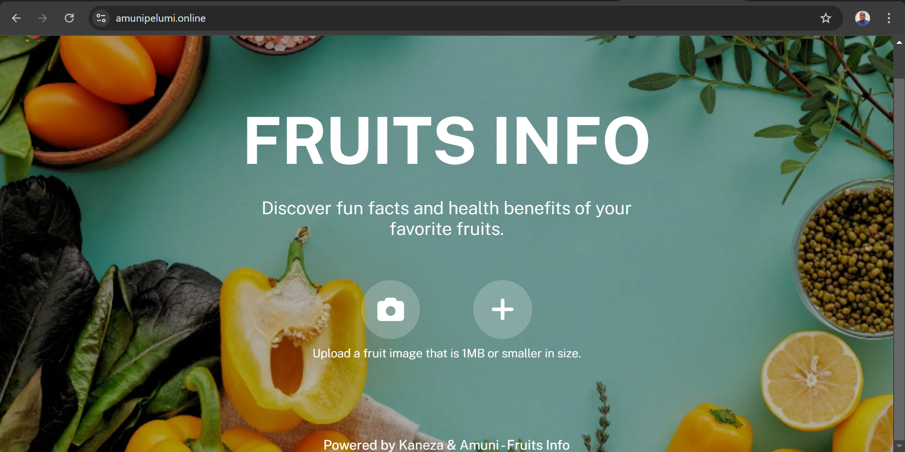
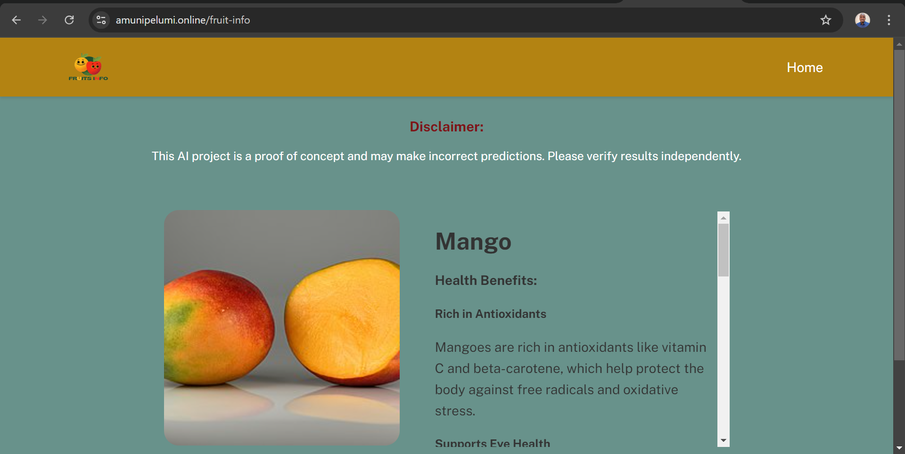
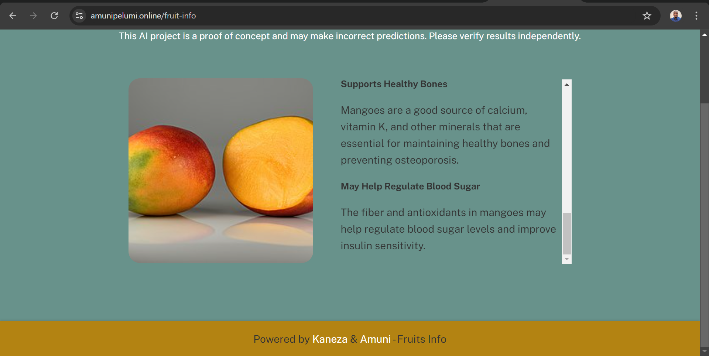

# **Fruit Info AI**  
Fruit Info AI is a machine learning-powered application that identifies various fruits and provides detailed health benefits for each one.  

### **Description**
This is a Django application that utilizes a TensorFlow classification model to identify and provide health benefits for up to 100 different types of fruit.   

The inference model is ONNX format integrated with an AI agent leveraging [Groq](https://groq.com/) for detailed inference to deliver excellent result.  

A lightweight version is hosted and can be accessed at [amunipelumi.online](https://amunipelumi.online/).  

This project was born out of my need not only to build ML models but also to integrate them into well-functioning applications that can be used for practical purposes.  

The training notebook, sample images and some of the training logs can be found [**here**](https://github.com/emmanuelamuni/ml-training/tree/main/fruit-info-ai/)  

### Table of Contents
- [Setup and Installation](#Setup-and-Installation)
- [Screenshots](#Screenshots)
- [License](#License)
- [Contact](#Contact)

### **Setup and Installation**  

To setup this project locally involves some steps.  
Below is a walkthrough on how to set it up on windows as a normal development server and on ubuntu as an emulation of production server.  

### Prerequisites
- [Python 3.9+](https://www.python.org/downloads/)
- [PostgreSQL](https://www.postgresql.org/download/)
- [Celery](https://docs.celeryq.dev/en/stable/django/first-steps-with-django.html#django-first-steps)
- [Redis](https://redis.io/docs/latest/operate/oss_and_stack/install/install-redis/)
- [Docker](https://docs.docker.com/engine/install/)

### Steps
- Clone the repository
   ```bash
      git clone https://github.com/emmanuelamuni/fruit-info-ai  
   ```

- Change directory
   ```bash
      cd fruit-info-ai  
   ```  

- Setup a virtual environment
   ```bash
      py -m venv <name of virtual environment> # for windows
      python3 -m venv <name of virtual environment> # for linux
   ```

- Activate virtual environment
   ```bash
      .\<name of virtual environment>\Scripts\activate # for windows
      source <name of virtual environment>/bin/activate # for linux
   ```

- Install dependencies
   ```bash
      pip install -r requirements.txt 
   ```

- Setup environment variables
    - `DEBUG`: Set to `True` for development or `False` for production.
    - `CONTAINER`: Set to `True` for docker, otherwise `False`.
    - `GROQ_KEY`: Setup your API key from [Groq](https://groq.com/)
    - `DJANGO_SECRET`: Input your Django secret key.
    - `ALLOWED_HOSTS`: Comma seperated values of your preferred hostnames/IP.
    - `REDIS_IP`: Typically your localhost IP address.
    - `REDIS_IP_C`: Typically "host.docker.internal" used by docker to talk to host machine.
    - `REDIS_PASS`: Password of your redis server.
    - `DATABASE_FRUIT_INFO`: Connection string to PostgreSQL database.
    - `DATABASE_FRUIT_INFO_C`: Connection string to PostgreSQL database from inside docker container, remember to replace localhost with "host.docker.internal" if the database is running on host machine.
    - `Optional variables`: Check settings.py to confirm other environment variables that needs to be set, checkout places with `os.getenv()` in the codes.

- Running the program
    - Windows
      ```bash
         celery -A fruit_info worker -l INFO --concurrency=4 --without-gossip --without-mingle--without-heartbeat -Ofair --pool=solo
         py manage.py runserver 
      ```
    - Ubuntu
      ```bash
         celery -A fruit_info worker -l INFO --concurrency=4 --without-gossip --without-mingle --without-heartbeat -Ofair --pool=solo
         python3 manage.py runserver 
      ```
    - Docker
      ```bash
         docker-compose up -d
      ```
    - Note: Remember to configure NGINX or your preferred web server to handle static files otherwise set Debug to True.

### **Screenshots**




### **License**
This project is licensed under the MIT License.  
See the [LICENSE](LICENSE) file for details.

### **Contact**
- Name: Emmanuel Amuni
- Email: [Emmanuel Amuni](mailto:amuni.engr@gmail.com)
- LinkedIn: [Emmanuel Amuni](https://www.linkedin.com/in/emmanuelamuni/)
